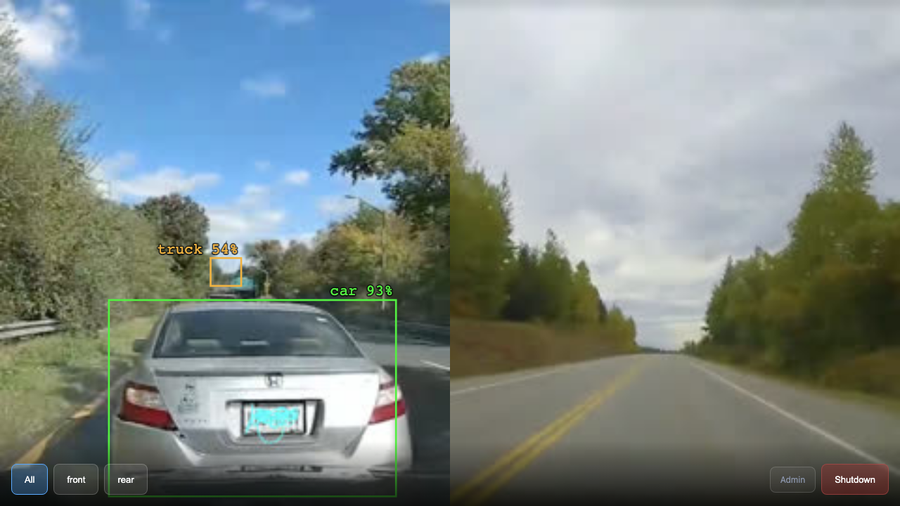
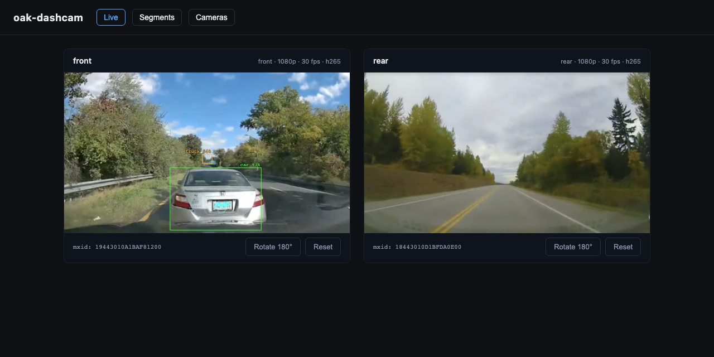
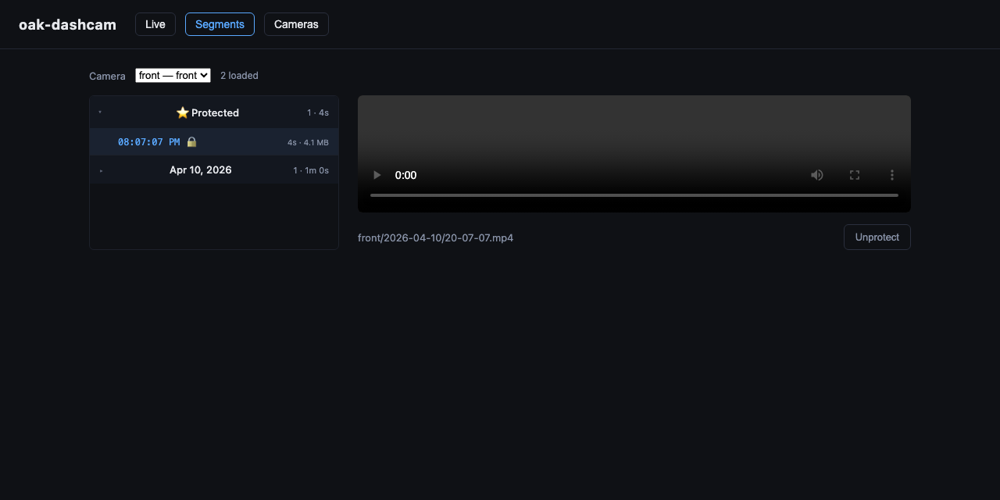
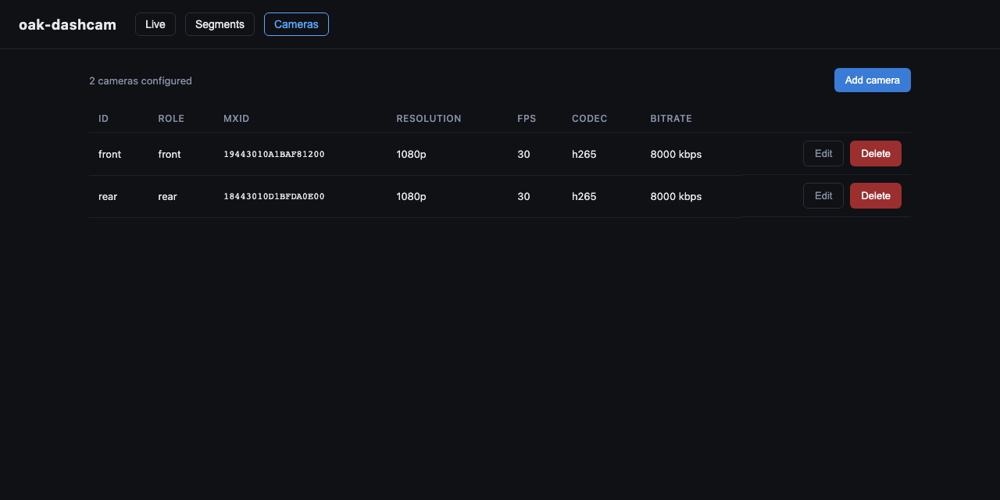

# oak-dashcam

Multi-camera dashcam system for Raspberry Pi + Luxonis OAK cameras, with a web UI
for live viewing, browsing, streaming, and downloading recordings.

Everything heavy runs on the OAK's Myriad X VPU — H.265 encoding for storage,
MJPEG for live preview, and YOLO object detection — so the Pi never touches a
video frame with its CPU.

## The UI

**Display mode** (the default landing page) turns a screen wired to the Pi into
a kiosk: fullscreen camera grid, tap a feed to focus it, tap again to go back.
Controls fade in on tap and hide themselves. Detection bboxes render live on
top of the streams.



**Admin mode** (navigate to `#admin`) is the management UI — live previews with
per-camera rotate/reset, a segment browser with an inline player and
incident-protect flags, and camera configuration:



| Segments | Cameras |
| --- | --- |
|  |  |

> Screenshots show the real webapp with the capture sidecar stubbed to replay
> sample footage; the detection boxes are canned data — on the Pi they come
> from YOLO running on the OAK itself.

## Features

- **Multi-camera capture** — one supervisor per OAK, independently restarted
  with backoff; one camera dying never stops the others.
- **Rolling recording** — 60 s H.265 segments, loop-deletion of the oldest
  unprotected clips once `retention_gb` is hit, protect flag for incidents.
- **Live preview** — on-device MJPEG side-stream, fanned out to any number of
  browsers without touching the recording pipeline.
- **On-device object detection** — YOLO (as a DepthAI NNArchive) runs on the
  OAK's VPU; detections are polled as JSON and drawn client-side as an SVG
  overlay. No video re-encoding anywhere.
- **S3 model sync** — capture checks a configured S3 bucket at startup for the
  newest model archive, downloads and caches it locally, and falls back to the
  cached copy (or to no detection, with a warning) when S3 is unreachable or
  unconfigured.
- **Kiosk + admin UI** — display mode for an in-car screen, admin mode for a
  phone on the Pi's Wi-Fi AP. Includes a host shutdown button.
- **Fully dockerized** — `docker compose up` is the deploy story.

## Layout

```
shared/          # Pydantic config + SQLite stores shared by both services
capture/         # Capture service (DepthAI → segmented MP4, detection, sidecar API)
webapp/backend/  # FastAPI API: clips, live-preview proxy, detections proxy
webapp/frontend/ # React + Vite SPA (display mode + admin mode)
config/          # dashcam.yaml — single source of truth for all knobs
deploy/          # docker-compose + Pi-specific config
docs/            # screenshots etc.
```

The two services share nothing in-process: they communicate through the
storage volume (segments + one SQLite file) and a small HTTP sidecar the
webapp proxies. The webapp can crash, restart, or be redeployed without
recording dropping a frame.

## Object detection

Detection is configured in `dashcam.yaml`:

```yaml
detection:
  enabled: true
  confidence_threshold: 0.5
  # model_dir: /data/dashcam/models   # default: {storage.root}/models
  s3:
    bucket: my-models-bucket
    prefix: dashcam/
    region: us-east-1
```

Models are **DepthAI NNArchives** (`.tar.xz` bundles containing the
RVC2-compiled blob plus decode config — input size, anchors, class names).
Export YOLOv5–v11 weights with [Luxonis tools](https://tools.luxonis.com);
raw `.pt`/`.onnx` files won't work. Upload archives to the bucket and capture
picks the newest one (by `LastModified`) on its next start.

AWS credentials come from the environment only (see the `environment:` block
in [deploy/docker-compose.yml](deploy/docker-compose.yml)) — never from the
YAML. The fallback chain is deliberate: S3 unreachable → use the local cache;
no cache and no S3 → log a warning and record without detection. A bad or
missing model can never stop recording.

## Development

This repo uses a [uv](https://docs.astral.sh/uv/) workspace.

```bash
# install everything (shared + capture + webapp + dev tools)
uv sync

# run the capture service against the default config
uv run python -m oak_dashcam_capture --config config/dashcam.yaml

# run the webapp backend
uv run python -m oak_dashcam_webapp --config config/dashcam.yaml

# frontend dev server (proxies /api to the backend)
cd webapp/frontend && npm install && npm run dev

# checks
uv run ruff check .
uv run ruff format --check .
uv run mypy
uv run pytest
cd webapp/frontend && npx tsc --noEmit
```

Without OAK hardware attached, capture automatically runs with mock cameras;
`OAK_DASHCAM_MOCK=1` forces it.

## Deploy

```bash
docker compose -f deploy/docker-compose.yml up -d
```

On-Pi runtime config lives in
[deploy/dashcam.docker.yaml](deploy/dashcam.docker.yaml) (mounted into both
containers), which currently diverges from the repo default: single camera,
storage on the microSD at `/var/lib/oak-dashcam`, 10 GB retention.
